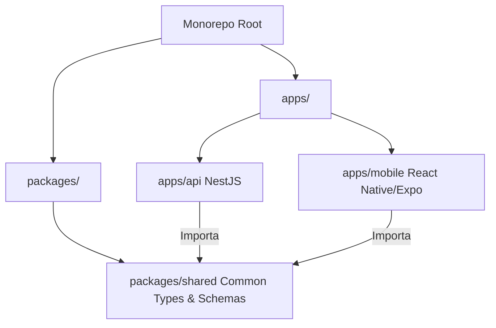
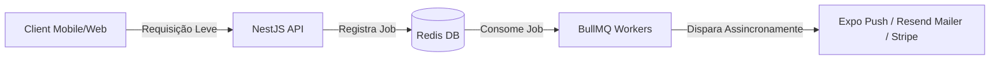

# System Architecture

**Analysis Date:** 2026-05-24

O ecossistema **PECAÊ** foi projetado sob os pilares de escalabilidade, forte integridade de dados e alta performance móvel. Este documento descreve a visão geral da arquitetura de software, padrões de design e fluxos estruturais do sistema.

---

## 🏗️ 1. Padrão Monorepo (Turborepo & npm Workspaces)

O projeto adota uma estrutura monorepo moderna, permitindo o compartilhamento eficiente de código, tipagens e configurações, mantendo o controle centralizado e pipelines de build rápidos.

* **Turborepo (`turbo.json`):** Coordena as tarefas de build, lint e testes. Com o cache inteligente do Turborepo, arquivos não alterados não são reprocessados, reduzindo drasticamente o tempo de CI/CD e desenvolvimento local.
* **Shared Package (`packages/shared`):** Centraliza definições de tipos TypeScript compartilhados entre a API e o aplicativo Mobile (ex: estruturas de dados de peças, status de veículos, payloads de chat).

---

## 🎛️ 2. Backend (NestJS & Prisma)

A API central (`apps/api`) segue os rígidos princípios de Clean Architecture do **NestJS** (Modularidade, Injeção de Dependências e Separação de Preocupações).

### 2.1 Estrutura Modular
A API é organizada de forma totalmente modular. Cada domínio de negócio possui seu próprio módulo, encapsulando controladores, serviços, gateways e repositórios:
* **Catálogo e Estoque:** `catalog`, `vehicles`, `listings` - Gerenciam o inventário de autopeças de sucatas rastreadas.
* **Usuários e Perfis:** `users`, `buyers`, `sellers`, `verifications` - Cuidam de perfis diferenciados de compradores e vendedores, além da verificação de KYC.
* **Comunicação e Interação:** `chat`, `notifications`, `mail` - Viabilizam a troca de mensagens em tempo real e notificações push.
* **Segurança:** `auth`, `moderation`, `reports` - Garantem integridade e combate a abusos.

### 2.2 Segurança e CASL (Controle de Acesso RBAC / ABAC)
O PECAÊ implementa controle de acesso granular utilizando a biblioteca `@casl/ability`.
* **RBAC (Role-Based Access Control):** Diferenciação estrita de permissões entre `BUYER`, `SELLER` e `ADMIN/MODERATOR`.
* **ABAC (Attribute-Based Access Control):** Autorização baseada nos atributos dos dados (ex: um vendedor só pode alterar ou deletar os seus próprios anúncios; um moderador não pode aprovar a sua própria solicitação de verificação de loja, prevenindo conflito de interesses).

### 2.3 Transacionalidade e Banco de Dados (Prisma ORM)
* **Garantia de Consistência:** Operações complexas (como o cadastro de um veículo junto com suas fotos, marcações de peças disponíveis e criação do anúncio ativo) utilizam **Prisma Transactions** (`$transaction`). Isso garante atomicidade: se o upload de metadados de uma foto falhar, toda a operação é revertida de forma segura.

---

## 📱 3. Frontend Mobile (Expo & React Native)

O aplicativo móvel (`apps/mobile`) foi concebido para oferecer uma experiência nativa de alto desempenho (60 FPS) e navegação intuitiva.

### 3.1 Expo Router e Estrutura de Rotas
* **Roteamento Baseado em Arquivos:** Estrutura organizada dentro da pasta `apps/mobile/app/`, facilitando o entendimento visual do fluxo do aplicativo (telas de autenticação, área do comprador, área do lojista e chat).

### 3.2 Gerenciamento de Estado Global (Zustand)
O estado global do aplicativo é descentralizado e ultra-leve utilizando o **Zustand**.
* **Persistência Segura (`auth-store`):** Credenciais e tokens JWT de sessões são persistidos de maneira segura no dispositivo utilizando o **Expo Secure Store**, garantindo criptografia em repouso dos dados de autenticação.
* **Funil de Cadastro de Anúncios:** Wizards complexos de múltiplos passos retêm as informações no estado local do app, realizando apenas uma única chamada HTTP transacional de criação ao término do fluxo, evitando requisições HTTP redundantes e fragmentação de dados.

### 3.3 Comunicação e Interceptors do Axios
* **Gestão de Sessão Resiliente:** Um interceptor do Axios é responsável por escutar erros HTTP de não-autorizado (`401 Unauthorized`). Ao detectar a expiração do Access Token, o interceptor pausa as requisições pendentes, realiza o refresh automático do token junto à API usando o Refresh Token persistido e reexecuta as chamadas originais de forma totalmente transparente para o usuário.

---

## ⚡ 4. Processamento Assíncrono, Filas e Tempo Real

Para manter tempos de resposta inferiores a 100ms nas requisições HTTP, processos pesados ou paralelos são completamente desacoplados.

### 4.1 Redis e BullMQ (Workers de Segundo Plano)
* **BullMQ** gerencia filas assíncronas dedicadas para:
  - **Fila de Notificações:** Envio massivo e unitário de notificações push e e-mails transacionais.

  - **Fila de Catalogação:** Processamento secundário de dados de compatibilidade de peças e indexação de buscas.
* **Anti-Fraude e Deduplicação:** O Redis monitora requisições de visualização de anúncios (`listing-views`). Um algoritmo baseado no IP e ID do usuário bloqueia a duplicação artificial de visualizações (limite de 1 visualização por usuário a cada 24 horas), mitigando fraudes em anúncios patrocinados.

### 4.2 Gateway Realtime (WebSockets & Socket.io)
* **Chat Fluido:** A troca de mensagens utiliza conexões persistentes via WebSockets (`SocketGateway` no NestJS). Mensagens enviadas são salvas de forma persistente no banco e replicadas instantaneamente aos clientes conectados.
* **Mecanismos de Fallback:** Caso a conexão via WebSockets falhe devido a restrições de rede móvel (3G/4G), o sistema automaticamente recorre ao HTTP Polling, garantindo que o usuário nunca deixe de receber suas mensagens.

---

## 🗄️ 5. Modelagem e Integridade do Banco de Dados

O banco de dados PostgreSQL 16 (hospedado no Supabase) foi modelado com restrições rígidas de integridade referencial e chaves estrangeiras.

* **Relacionamentos Complexos:**
  - `User` possui relação `1:1` opcional com `SellerProfile` (perfil profissional) e `BuyerProfile` (perfil padrão).
  - Um `Vehicle` pertence a um `SellerProfile` e possui múltiplos `Listing` (anúncios) e `VehiclePhoto` (com ordenação controlada via índice).
  - O `ChatRoom` vincula estritamente um `BuyerProfile`, um `SellerProfile` e opcionalmente um `Vehicle`/`Listing` específico para contexto de negociação de peças.
* **Índices de Performance:** Campos comumente buscados de forma exata ou ordenada (ex: `slug` de categorias, status de anúncios, coordenadas geográficas `lat`/`lng` para buscas por raio de distância) possuem índices criados no banco de dados para evitar varreduras completas de tabelas (Table Scans).

---

*Architecture review: 2026-05-24*
